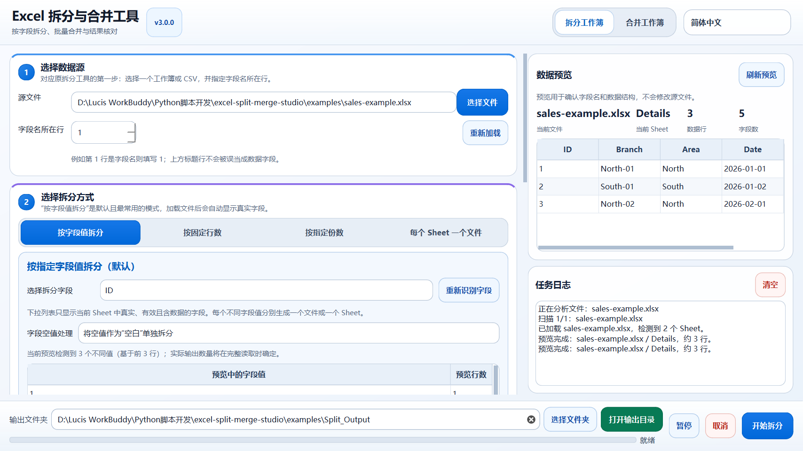
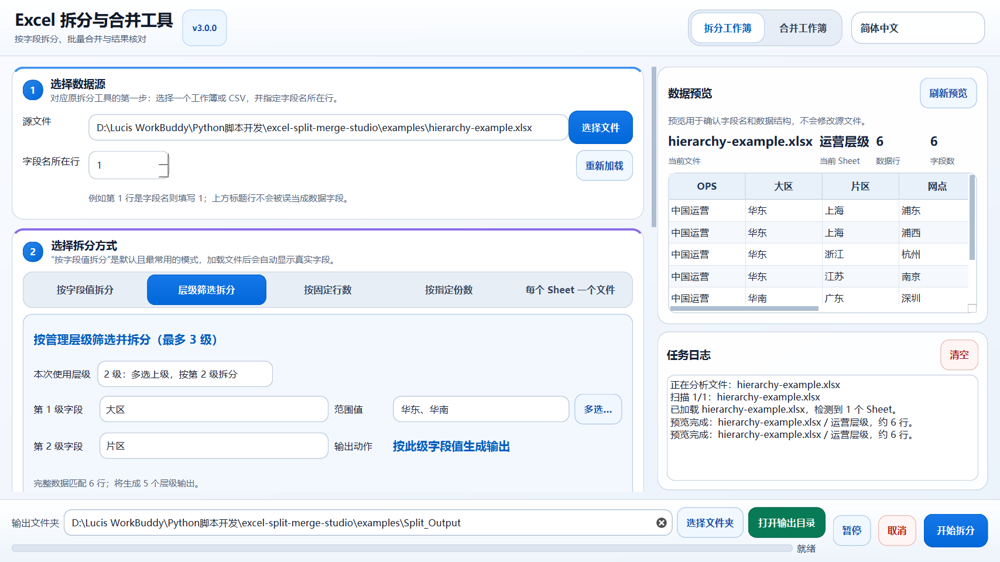

# Excel Split & Merge Studio

面向 Excel 日常办公与批量数据处理的中英双语桌面软件。它将字段值拆分、最多三级的
管理层级多选拆分、纵向/横向合并、字段匹配关联、同名 Sheet 汇总和分组聚合集中在一个
响应式界面中。

A bilingual desktop application for everyday Excel operations: field-value splitting,
multi-select hierarchy splitting with up to three levels, vertical and horizontal merging,
key-based joins, same-name worksheet consolidation, and grouped aggregation.





## 下载 / Downloads

GitHub Release 工作流会在对应原生系统生成以下文件：

- `ExcelSplitMergeStudio-3.0.0-Windows.exe` — Windows 10/11 免安装可执行文件；
- `ExcelSplitMergeStudio-3.0.0-Windows-Setup.exe` — Windows 安装程序；
- `ExcelSplitMergeStudio-3.0.0-macOS.dmg` — macOS 磁盘映像；
- `Excel_Split_Merge_Studio.py` — 内置完整项目源码的单文件 Python 启动器；
- `SHA256SUMS.txt` — 发布文件校验值。

The release workflow builds native Windows and macOS artifacts on their matching GitHub runners.
The project never disguises a renamed archive as an EXE or DMG.

## 核心功能 / Core Features

### 拆分 / Split

- “按指定字段值拆分”位于首屏并作为默认模式；
- “层级筛选拆分”支持 2～3 级管理层级；
- 每个上级范围均可搜索、多选、全选当前结果、清空或手工添加精确值；
- 可同时选择多个大区，再按各自片区拆分；
- 3 级模式可多选大区和片区，再按网点拆分；
- 多个父级下的同名子级按完整层级路径分别输出，不会误合并；
- 层级范围值从完整 Sheet 后台读取，不只依赖预览行；
- 每个不同字段值生成一个文件或一个 Sheet；
- 空字段值可单独分组，也可跳过；
- 按固定行数、指定份数或每个 Sheet 一个文件拆分；
- 可选择全部、可见、当前单个或自定义多选 Sheet；
- 支持 `.xlsx`、`.xlsm`、`.xls`、`.xlsb`、`.csv`、`.tsv`（旧格式需要可选依赖）；
- 输出自动编号，默认不覆盖已有文件。

- “Split by selected field value” remains the default above-the-fold workflow;
- hierarchy splitting supports two or three management levels;
- every parent scope supports searchable multi-selection, Select Visible, Clear, and exact custom values;
- select multiple Areas and split by their Districts, or select multiple Areas and Districts before splitting by Branch;
- same-named children under different parents remain separate path-based outputs;
- hierarchy values are read from the complete worksheet in a background thread;
- one output file or worksheet per distinct target path;
- blank values can be grouped or skipped;
- fixed-row, fixed-part, and one-file-per-sheet splitting;
- all, visible, current, or custom worksheet scope;
- safe auto-numbering instead of overwriting existing output by default.

See [层级筛选拆分说明 / Hierarchy Split Guide](docs/HIERARCHY_SPLIT.md).

### 合并 / Merge

- 纵向追加：严格一致、字段对齐、并集、交集、主表字段或按列位置；
- 关键字段 Join：Left、Right、Inner、Full Outer；
- 重复键策略、键值规范化、单字段模糊匹配和字段冲突处理；
- 多工作簿 Sheet 原样汇总；
- 同名 Sheet 跨文件汇总；
- 横向按行拼接，可设置来源前缀与空白列间距；
- 分组求和、计数、平均、最小、最大和去重计数；
- 全行或指定字段去重、来源追踪、任务报告与行数核对。

- vertical append with strict, aligned, union, intersection, master, or positional schemas;
- Left, Right, Inner, and Full Outer key joins;
- duplicate-key policies, normalized keys, fuzzy matching, and conflict handling;
- workbook-level and same-name-sheet consolidation;
- side-by-side concatenation with source prefixes and configurable gaps;
- grouped aggregation, deduplication, source tracking, task reports, and reconciliation.

## 商业级交互 / Product UX

- 顶部“拆分工作簿 / 合并工作簿”切换；
- 中英语言实时切换；
- 高对比度浅色 Liquid Glass 风格；
- 左侧步骤卡片、右侧数据预览与日志、固定底部操作栏；
- 初始窗口按屏幕可用区域约 86% × 84% 居中打开，不默认最大化；
- 左侧内容可滚动，适配 1366×768、1920×1080 与系统 DPI 缩放；
- 文件扫描、范围值读取、预览和实际处理均在后台线程执行；
- 支持暂停、继续、取消、进度显示和打开输出目录。

- live Split/Merge workspace and Chinese/English switching;
- high-contrast light Liquid Glass-inspired visual system;
- step cards on the left, preview and logs on the right, and a fixed action footer;
- centered responsive startup geometry without forced maximization;
- scrollable content for smaller displays and system DPI scaling;
- background scanning, hierarchy-value discovery, preview, and workbook processing;
- pause, resume, cancel, progress, and output-folder access.

## 直接运行 Python 版本 / Run from Python

需要 Python 3.11 或更新版本：

```powershell
python -m pip install -r requirements.txt
python Excel_Split_Merge_Studio.py
```

开发模式：

```powershell
python -m pip install -e ".[dev,legacy]"
python -m excel_studio
```

The single-file launcher contains a verified compressed copy of the maintained `excel_studio`
package and extracts it to a versioned local cache before starting.

## 操作流程 / Basic Workflow

### 按字段值拆分

1. 打开软件后保持默认“按字段值拆分”。
2. 选择源工作簿并确认字段名所在行。
3. 从“选择拆分字段”中选定真实字段。
4. 确认 Sheet 范围、空值策略、输出目录和命名规则。
5. 点击“开始拆分”，确认摘要后等待完成。

### 层级筛选拆分

1. 第 1 步选择源文件。
2. 第 2 步切换到“层级筛选拆分”。
3. 选择 2 级或 3 级。
4. 在每个上级字段中点击“多选”，搜索并勾选一个或多个范围值。
5. 将最深一级设置为拆分目标，并查看完整数据匹配行数与预计输出数量。
6. 设置输出目录并开始拆分。

同一级内的多个范围值采用“或”关系，不同层级之间采用“且”关系。例如，大区选择
“华东、华南”，片区选择“上海、广东”，表示：
`大区 ∈ {华东, 华南} AND 片区 ∈ {上海, 广东}`。

For a two-level task, select one or more parent values, then choose the level-2 target field.
For a three-level task, multi-select both parent scopes and use level 3 as the split target.
Selections are OR-ed within a level and AND-ed across levels.

### 合并

1. 切换到“合并工作簿”。
2. 添加文件或文件夹，并确认表头行和 Sheet 范围。
3. 选择合并模式并配置对应规则。
4. 设置输出名称、格式和同名文件策略。
5. 点击“开始合并”，完成后查看输出与任务报告。

## 项目结构 / Project Layout

```text
excel-split-merge-studio/
├─ src/excel_studio/
│  ├─ config/       # 中英文本、设置与常量
│  ├─ models/       # 拆分、合并、执行与结果模型
│  ├─ services/     # 扫描、读取、拆分、合并、输出与核对
│  ├─ ui/           # 唯一正式 PySide6 界面
│  └─ workers/      # 后台任务线程
├─ tests/           # 单元、集成、UI 与性能测试
├─ examples/        # 示例工作簿与规则模板
├─ installer/       # Windows 安装脚本
├─ scripts/         # 单文件构建、截图与打包验证
└─ .github/workflows/
```

## 测试 / Tests

```powershell
$env:QT_QPA_PLATFORM = "offscreen"
python -m pytest -q
python -m ruff check src tests scripts
python -m mypy --config-file mypy-final.ini src/excel_studio
```

当前自动化测试覆盖原有拆分/合并逻辑、两级与三级层级多选、级联完整数据范围值读取、
同名子级隔离、筛选排除行核对、中英文切换、响应式窗口和固定底栏。

Tests cover existing split and merge behavior, two- and three-level hierarchy multi-selection,
cascading full-data value discovery, duplicate child-name isolation, excluded-row reconciliation,
bilingual UI, responsive layout, and the fixed action footer.

## 构建 / Packaging

Windows：

```powershell
python scripts/build_single_file.py
python -m PyInstaller --noconfirm --clean excel-studio-release.spec
python scripts/verify_packaged_app.py dist/ExcelSplitMergeStudio.exe
```

macOS：

```bash
python -m PyInstaller --noconfirm --clean excel-studio-release.spec
python scripts/verify_packaged_app.py \
  dist/ExcelSplitMergeStudio.app/Contents/MacOS/ExcelSplitMergeStudio
hdiutil create -volname "Excel Split & Merge Studio" \
  -srcfolder dist/ExcelSplitMergeStudio.app -ov -format UDZO \
  release/ExcelSplitMergeStudio-3.0.0-macOS.dmg
```

推送 `v*` 标签后，`.github/workflows/release.yml` 会在 Windows 与 macOS 原生运行器构建、
验证并上传所有文件到 GitHub Release。

## 数据安全与限制 / Data Safety & Limitations

- 源文件仅作为输入读取；默认策略不会覆盖源文件或已有输出。
- 层级范围值采用规范化后的精确匹配，不进行模糊归类。
- 多选父级时使用完整层级路径命名并分组，防止同名子级跨父级合并。
- 复杂图表、图片、外部链接、条件格式和 VBA 跨工作簿复制采用尽力保留。
- 公式不会由 Python 像桌面 Excel 一样完整重算。
- 未签名的 Windows/macOS 构建可能触发系统安全提示。

- source workbooks are read-only inputs and existing outputs are auto-numbered by default;
- hierarchy scope values use normalized exact matching, not fuzzy classification;
- full path grouping keeps same-named children under different selected parents separate;
- complex workbook objects are preserved on a best-effort basis;
- Python does not fully recalculate formulas like desktop Excel;
- unsigned builds may trigger operating-system security warnings.

安全问题请参阅 [SECURITY.md](SECURITY.md)。版本变更请参阅 [CHANGELOG.md](CHANGELOG.md)。
